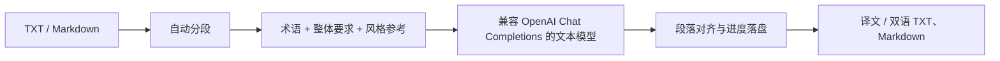

<div align="center">

# 长文翻译器

**连接你自己的模型，把 TXT / Markdown 长文按段翻译、对照检查，并在中断后继续。**


一个本地运行的多语言长文翻译工作台，适合书籍、学习资料、技术文档和双语内容整理。

</div>

> [!IMPORTANT]
> 任务、配置和结果保存在本机；开始翻译后，原文以及已启用的术语、整体要求和风格参考会发送到你配置的模型服务。

## 为什么用它

| 能力 | 你能得到什么 |
| --- | --- |
| 可配置模型接口 | 在页面填写 URL、API Key 和模型名称，不把应用绑定到单一服务商 |
| 多语言原文 | 模型按提示判断原文语言，目标语言支持中文、日语、韩语或自定义 |
| 长文续跑 | 按段保存进度，支持暂停、继续和失败重试，已完成段落不会重复请求 |
| 可控翻译 | 提供忠实直译、自然阅读、专业表达、润色程度和翻译速度设置 |
| 术语与风格 | 逐条添加固定译法、整体要求和风格参考，让长文表达更一致 |
| 对照与导出 | 原文 / 译文双栏检查，可导出译文或双语版 TXT、Markdown |

## 从原稿到译稿



## 快速开始

环境要求：

- Python 3.10+
- Node.js 18+

先运行 `python3 --version`（Windows 使用 `python --version`）确认版本。如果低于 3.10，请把下面命令中的解释器替换为本机已安装的 `python3.10`、`python3.11` 或更高版本。

### 1. 获取项目

```bash
git clone https://github.com/zshiwo355-afk/-.git text-book-translator
cd text-book-translator
```

### 2. 启动后端

macOS / Linux：

```bash
python3 -m venv .venv
source .venv/bin/activate
pip install -r backend/requirements.txt
uvicorn backend.app:app --reload --host 127.0.0.1 --port 8000
```

Windows PowerShell：

```powershell
python -m venv .venv
.\.venv\Scripts\Activate.ps1
pip install -r backend\requirements.txt
uvicorn backend.app:app --reload --host 127.0.0.1 --port 8000
```

### 3. 启动前端

另开一个终端：

```bash
cd frontend
npm ci
npm run dev
```

打开 [http://127.0.0.1:5173](http://127.0.0.1:5173)。

### 4. 配置模型接口

在页面左侧填写：

1. **接口地址（URL）**：填写服务商提供的接口根地址，通常以 `/v1` 结尾，不要填写完整的 `/chat/completions`。
2. **API Key**：填写该服务的访问密钥。
3. **模型名称**：填写同一服务中的文本模型 ID。

三项必须属于同一个服务。保存只代表写入本机，地址、权限、额度和模型兼容性会在首次翻译时验证。API Key 不会回显到页面。

## 使用方法

1. 配置模型接口。
2. 拖入 UTF-8 编码的 `.txt` 或 `.md` 文件。
3. 选择目标语言、表达方式和翻译速度。
4. 按需添加术语、整体翻译要求或风格参考。
5. 开始翻译，在双栏工作区检查原文与译文。
6. 完成、暂停或失败后，导出当前可用结果。

暂停会等待当前翻译批次结束并保存后生效；继续时从未完成位置恢复。更换模型配置后，新的连接会用于之后开始或继续的请求，已经完成的内容不会自动重翻。

## 术语与风格控制

- **术语**：一次添加一个“原文词语 → 固定译法”，适合人名、产品名和专业术语。
- **整体要求**：例如“保持对白自然”“书名保留原文”，启用后随翻译批次发送。
- **风格参考**：提供“原文 → 期望译文”，每个批次最多携带最近启用的 3 条参考。
- **备份导入 / 导出**：页面导出的 `corpus.json` 可用于迁移或恢复语料库。

语料库不会训练模型，只会作为当前翻译请求的上下文。导入功能接受本项目导出的 JSON 备份，不是待翻译书籍或 Excel 词表导入器。

## 导出格式

| 文件 | 内容 |
| --- | --- |
| `原文件名.txt` | 纯译文 TXT |
| `原文件名.md` | 纯译文 Markdown |
| `原文件名_bilingual.txt` | 原文与译文对照 TXT |
| `原文件名_bilingual.md` | 带段落状态的原文与译文对照 Markdown |

任务未全部完成时也可以导出；未完成段落会保留原文并标记状态，便于后续处理。

## 模型兼容说明

项目通过 OpenAI Python SDK 调用 `chat.completions`。可用模型至少需要：

- 提供兼容 OpenAI Chat Completions 的接口；
- 接受 `model`、`messages`、`temperature` 和 `stream` 参数；
- 支持文本对话、多语言和足够的上下文长度；
- 能较稳定地按照提示返回带段落 ID 的结构化内容。

通用对话模型通常可以翻译，但并非所有“兼容接口”或所有模型都适合长文翻译。翻译质量、术语一致性、格式稳定性、速度和费用由你选择的模型服务决定。图片、语音和 Embedding 模型不能直接使用。

## 数据与使用边界

- 页面保存的模型配置位于 `backend/config.local.json`，手工环境变量配置位于根目录 `.env`；两者均已被 Git 忽略。
- 上传文件、任务进度和导出结果默认保存在 `backend/data/`。
- 翻译开始前不会发送文件内容；开始后，相关文本和启用的语料会发送到模型服务。
- 模型服务可能产生费用，请查看对应服务商的计费、额度和隐私政策。
- 当前版本面向本地单人工作流，不是带账号、权限和租户隔离的在线 SaaS。
- 当前上传入口只接受 UTF-8 编码的 TXT 和 Markdown 文件。

<details>
<summary><strong>环境变量配置</strong></summary>

页面配置是推荐方式，也可以复制 `.env.example` 为 `.env` 后手工配置：

```dotenv
VITE_API_BASE=http://127.0.0.1:8000

TOKENHUB_API_KEY=your-api-key
TOKENHUB_BASE_URL=https://api.example.com/v1
TRANSLATION_MODEL=your-model-id
DEFAULT_TARGET_LANGUAGE=简体中文
TRANSLATION_TEMPERATURE=0.1
TRANSLATION_STREAM=false
CHUNK_SIZE_CHARS=3500
MAX_RETRIES=3
```

`TOKENHUB_*` 是当前版本保留的历史变量名，不代表只能使用某个服务商。通过页面保存后，页面中的 URL、API Key 和模型名称优先。

</details>

<details>
<summary><strong>命令行翻译</strong></summary>

CLI 复用同一套模型配置、任务存储和续跑机制：

```bash
source .venv/bin/activate
python cli.py translate \
  --input ./book.txt \
  --target-language 简体中文 \
  --resume
```

</details>

## 技术栈

- 前端：React 18 + Vite 5
- 后端：FastAPI + Pydantic
- 模型调用：OpenAI Python SDK
- 实时状态：Server-Sent Events
- 本地存储：JSON 文件

## 开发检查

```bash
source .venv/bin/activate
python -m unittest discover -s tests -v
python -m compileall -q backend tests

cd frontend
npm run build
```

## 反馈

如果你遇到模型兼容、长文分段、语料导入或导出问题，欢迎通过 GitHub Issues 提交可复现信息。
